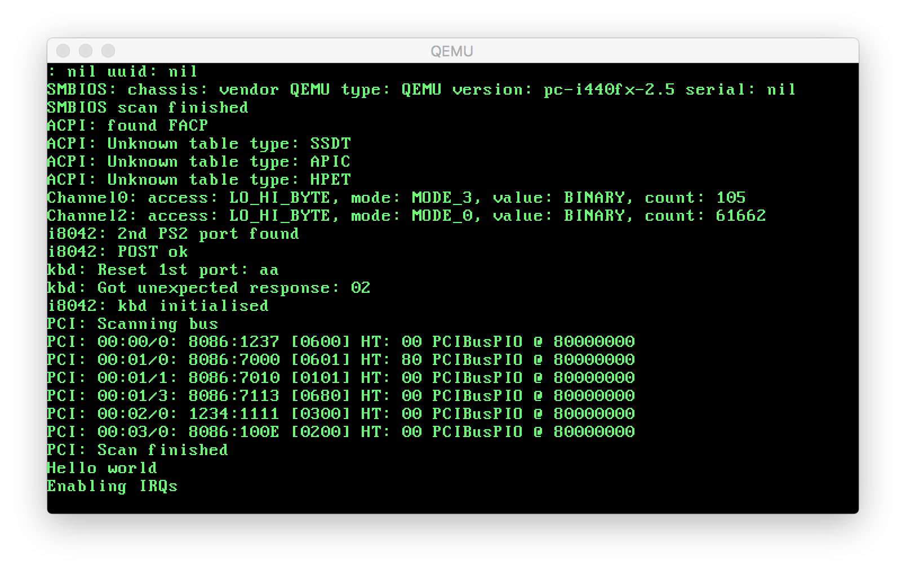

# project1 - Using Swift for lowlevel kernel programming

## What is it?

A test to see how easy it is to write lowlevel code in Swift. There is short
writeup about it [here](http://si.org/projects/project1).

## What does it do?

- Boots up (Under QEMU, Bochs or VMWare)
- Scans ACPI/SMBIOS tables
- Installs interrupts and exception/fault handlers
- Sets up paging
- Scans PCI bus
- Initialises timer and keyboard


## How to build it

Curently it only builds on linux. It requires:

* clang
* xorriso
* mtools
* nasm (known to work with 2.11.09rc1 but earlier should be ok)

Also needs the stable-2.2-branch of Swift from https://github.com/apple.
Clone the following branches of each repo then see
[here](doc/development.md#red-zone)
to build a swift compiler and stdlib with red-zone disabled.

| repo  | branch           |
|-------|------------------|
| swift | swift-2.2-branch |
| clang | swift-2.2-branch |
| llvm	| swift-2.2-branch |
| lldb  | swift-2.2-branch |
| cmark | swift-2.2-branch |
| ninja	| master		   |


If you install the swift compiler into a different directory to `~/usr` then
edit `SWIFTDIR` in `Makedefs`

then:
```
$ make kernel iso
$ qemu-system-x86_64 -hda disk_image

There is a bochsrc to specify the HD image so it can be run with:
$ bochs -q  (then press 'c' to run)
```




Copyright (c) 2015 Simon Evans

THE SOFTWARE IS PROVIDED "AS IS", WITHOUT WARRANTY OF ANY KIND, EXPRESS OR
IMPLIED, INCLUDING BUT NOT LIMITED TO THE WARRANTIES OF MERCHANTABILITY,
FITNESS FOR A PARTICULAR PURPOSE AND NONINFRINGEMENT. IN NO EVENT SHALL THE
AUTHORS OR COPYRIGHT HOLDERS BE LIABLE FOR ANY CLAIM, DAMAGES OR OTHER
LIABILITY, WHETHER IN AN ACTION OF CONTRACT, TORT OR OTHERWISE, ARISING FROM,
OUT OF OR IN CONNECTION WITH THE SOFTWARE OR THE USE OR OTHER DEALINGS IN THE
SOFTWARE.
