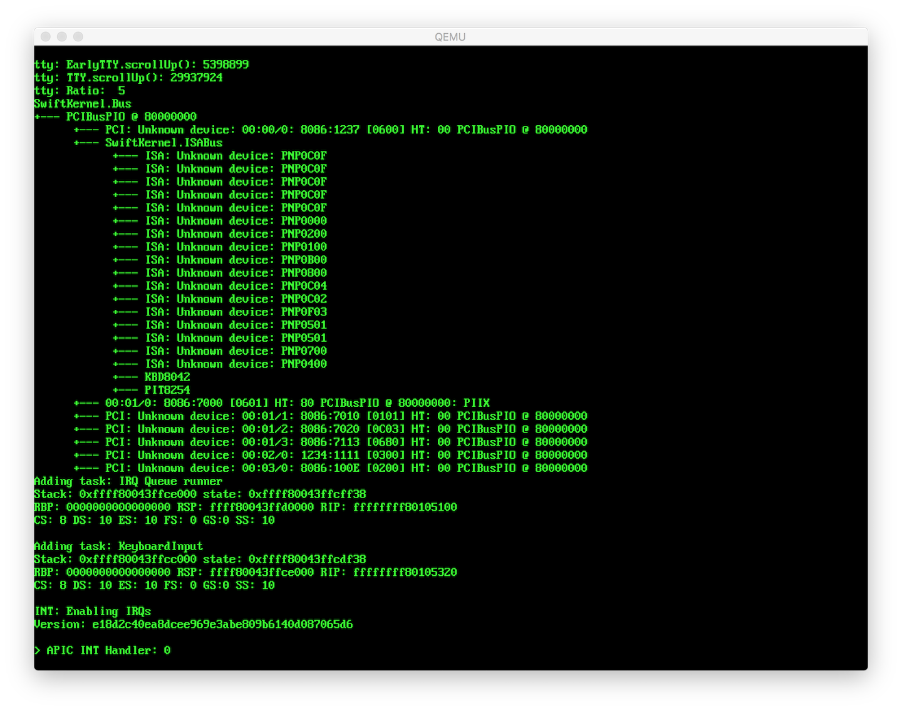

# project1 - Implementing a minimal bare metal kernel in Swift

## What is it?

A project to write a kernel in Swift that can boot on a Mac or PC.
The main aim is to get a simple kernel booting up with a CLI with full
concurrency/thread support.

There is a short writeup about it [here](http://si.org/projects/project1).

## Current status

- Boots up under QEMU, Bochs and VMWare. Also boots on Macbook 3,1 (13inch Late 2007)
- Installs interrupts and exception/fault handlers
- Sets up paging
- Scans ACPI/SMBIOS tables
- Parses ACPI tables including AML bytecode in DSDT, SSDT tables
- Initialises the APIC and IO/APIC (or PIC)
- Traverses the ACPI device tree adding known devices according to topology.
- Scans PCI bus (MMIO or PIO) to show vendor/device IDs
- Initialises the PIT and PS/2 keyboard controller
- Sets up an APIC and PIT timers and shows a test message with interrupt counts.
- Runs a simple task reading keyboard scan codes from a circular buffer and
  translates them to ASCII codes to show on the screen. The Macbook doesn't
  have an i8042 PS/2 keyboard controller so the keyboard will not work.

Currently working on enabling ACPI to process ACPI events and setting up more
devices including the Realtime Clock and PCI interrupts.

The next major tasks are:

- USB controller and USB keyboard driver for the keyboard on Macbook 3,1


## How to build it

Use Docker to build a container that includes the swift compiler with the modified stdlib using
the Dockerfile in `Docker/Dockerfile`.

### Build the docker container

```
$ docker build --tag=swift-kstdlib Docker
```

To build the kernel and disk images from the command line:
```
$ docker run --rm -v `pwd`:`pwd` -w `pwd` -t swift-kstdlib make iso
```
 or using Xcode, open `project1.xcodeproj`, select `kernel` in the target menu and then `Product → Build`
or ⌘-B to build it.


## How to run it

To run under qemu with a copy of the console output being sent to a virtual
serial port use:

`./run_qemu.sh`

or to use with UEFI/OVMF BIOS
`./run_qemu.sh --efi`

There is a bochsrc to specify the HD image so it can be run with:

`bochs -q`

(then press `c` to run)




Copyright (c) 2015 - 2020 Simon Evans

THE SOFTWARE IS PROVIDED "AS IS", WITHOUT WARRANTY OF ANY KIND, EXPRESS OR
IMPLIED, INCLUDING BUT NOT LIMITED TO THE WARRANTIES OF MERCHANTABILITY,
FITNESS FOR A PARTICULAR PURPOSE AND NONINFRINGEMENT. IN NO EVENT SHALL THE
AUTHORS OR COPYRIGHT HOLDERS BE LIABLE FOR ANY CLAIM, DAMAGES OR OTHER
LIABILITY, WHETHER IN AN ACTION OF CONTRACT, TORT OR OTHERWISE, ARISING FROM,
OUT OF OR IN CONNECTION WITH THE SOFTWARE OR THE USE OR OTHER DEALINGS IN THE
SOFTWARE.
